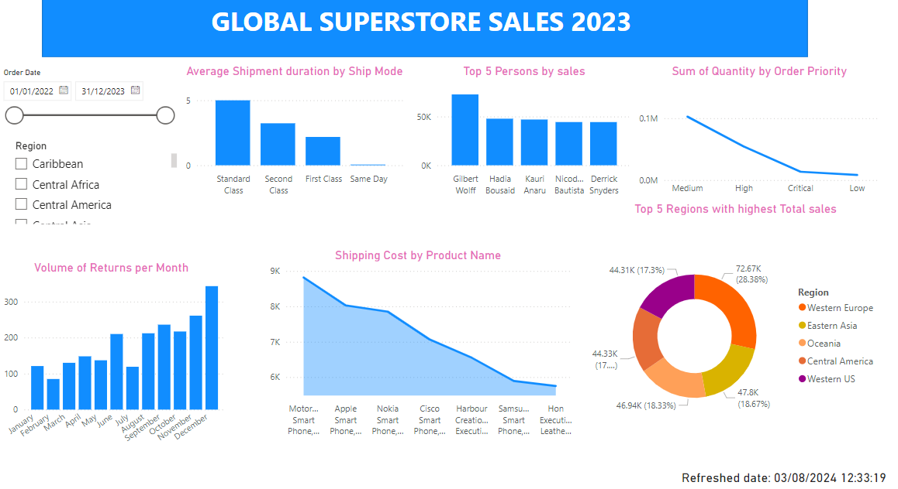

# Data Analytics Portfolio
# Project 1
**Title:** [Global Superstore Sales Performance Dashboard 2023](https://github.com/Onwano/Onwano.github.io/blob/main/POWER%20BI%20global%20superstore.pbix)

**Tools Used:** Power BI ( Power query editor, DAX, Data modelling), Excel
 
**Project Description:** This project analyses the Global Superstore Sales performance for financial year 2022/2023. Data was imported from Excel to Power BI to create the following insights
 
**Key findings:**
 
**Dashboard Overview:** 
  

# Project 2

**Title:** Pizza Sales Sql Queries

**Project Description:**The project was carried out to provide ad-hoc request to know total sum of sold pizza,sold 

**SQL codes:** [Pizza Sql Queries](https://github.com/Onwano/Onwano.github.io/blob/main/Pizza_Sales.Sql)

**SQL Skills Used:** Where clause, Group by clause, SUM, IN operator, Between operator .........

**Tools Used:** Excel, SQL sever
